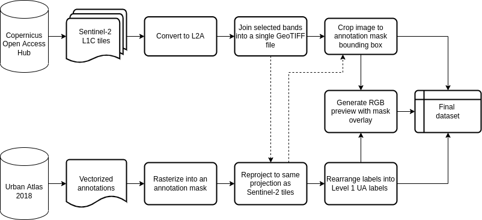
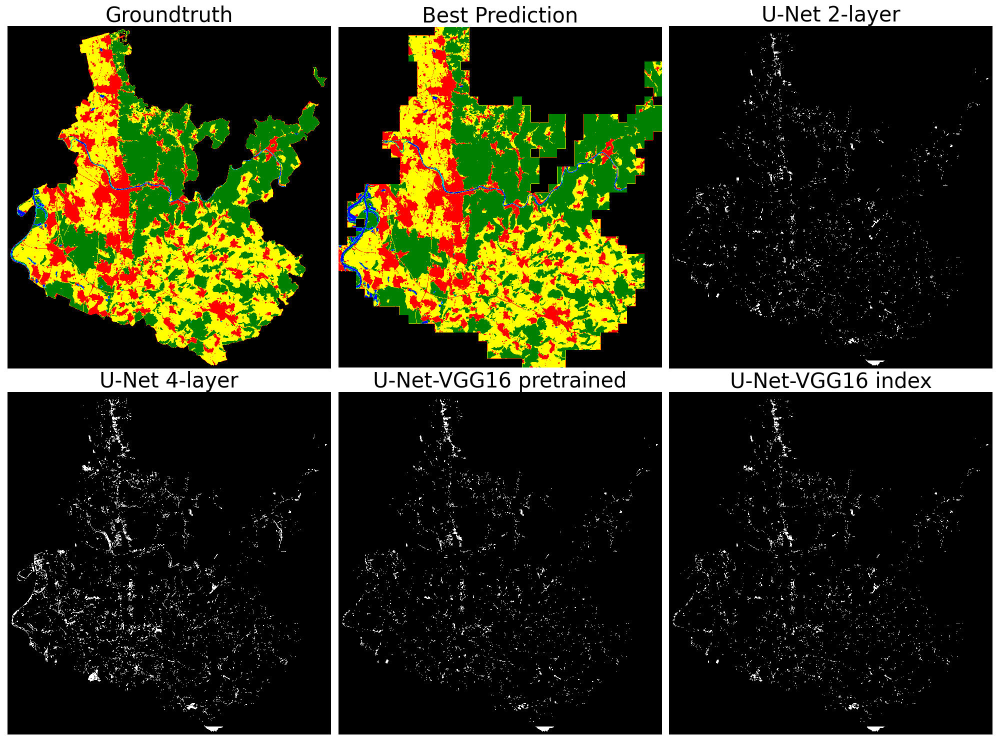
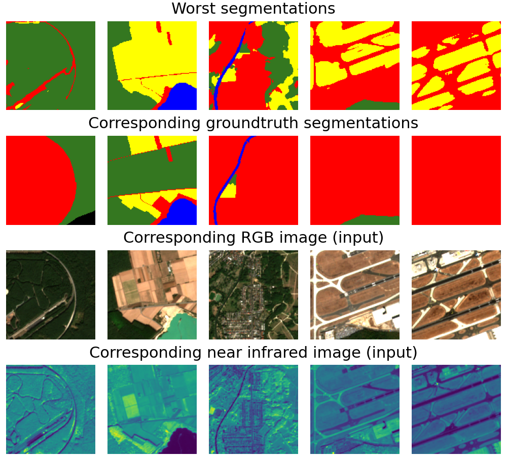

# AML_project: Semantic Segmentation with Satellite Images for Land Use Land Cover Task (LULC)

Final project for the lecture Advanced Machine Learning in the summer semester 2022

## Research question  

**Based on related work we want to investigate whether transfer learning improves semantic segmentation for the LULC problem for German cities to identify 5 classes, namely Artificial Areas, Agricultural Areas, Natural and seminatural areas, Wetlands and Water. Specifically, this is tested on the two cities Heidelberg and Frankfurt am Main.**

## Main Contribution: 
Transfer learning using a VGG16 as encoder that was pretrained on Sentinel-2 image data; and shallow network for index computation. 

## Usage of the Repository: 
Here, we provide a short overview how to use the main functions. All userfunctions are in the folder `/userfunctions`

### 1. Download and prepare the dataset
For downloading the dataset and splitting into training, validation and testset, please take a look at our seperate notebook. 
[prepare_city_data.ipynb](https://github.com/cemdaloglu/AML_project/blob/main/prepare_city_data.ipynb) 


<br/><br/>
<br/><br/>


### 2. Preprocess Data for Training: 

```

!python userfunctions/preprocess_data.py \
    --path <Path in which input images and annotations folder lie> \
    --hpatchsize <Patch height> \
    --wpatchsize <Patch width> \
    --padding <Whether padding should be used> \
    --path_output <Path in which to store the patched data> 

```

Creates a folder `path_output`/patches/ with subfolders `train`, `val`and `test` which again have subfolders with `images`and `masks` and stores the image patches and the corresponding mask as .npy-filed with three identifiers: xxx_cityidentifier_rowidentifier_columnidentifier, e.g. image_0_3_12.npy .
Consult `python userfunctions/preprocess_data.py --help` for a full list of command line options.


Example:

```
myFolder = "/AML-project/final/L2A/"

!python userfunctions/preprocess_data.py \
    --path "$myFolder" \
    --hpatchsize 128 \
    --wpatchsize 128 \
    --padding False \
    --horizontal_intersection 0 \
    --vertical_intersection 0 \
    --path_output "$myFolder" 

```


### 3. Training the Model

The training routine is made accessible through the `train.py` CLI. To train
the model, execute:

```
%load_ext tensorboard
%tensorboard --logdir runs/

!python userfunctions/train.py\
    --name <Model name>\
    --train_test_path <Path to where training and test data lie>\
    --result_path <Path for storing checkpoints and results>\
    --model <Which model to use, either "unet", "vgg_unet", "vgg_unet_pretrained" or "2layer_unet> \
    --loss_criterion <Which Loss to use. Either "wCEL",  or "CEL">\
    --freeze_e <Freezes VGG16 UNet pretrained layers for e epochs. Ignored for all other models>
    --epochs <Number of epochs> \
    --batch_size <training batch size>\
    --dataloader_workers <Num of workers for dataloader>\
    --learning_rate <Which learning rate to use for the optimizer>\
    -hflip <Proportion of horizontal flips for data transformation> \
    -vflip <Proportion of vertical flips for data transformation>
```

Creates a folder `result_path`/`name` and stores model checkpoints and metrics there.
Consult `python userfunctions/train.py --help` for a full list of command line options.

Example for training a model from scratch:

```
modelname = "unet_CEL_lr001_hflip03_vflip07"
root_path = '/content/drive/MyDrive/AML'

!python userfunctions/train.py\
    --name "$modelname"\
    --train_test_path "/content/patches_pad"\
    --result_path "results"\
    --model "unet" \
    --loss_criterion "CEL" \
    --epochs 100 \
    --batch_size 64\
    --dataloader_workers 2\
    --learning_rate 0.001\
    -hflip 0.2 \
    -vflip 0.2
```

### 4. Testing a model on the test dataset

For testing the model on the testset containing the patches of Heidelberg and Frankfurt am Main:

```
!python userfunctions/test.py\
    --name <Model name>\
    --train_test_path <Path to where training and test data lie>\
    --result_path <Path for storing testing results>\
    --model <Which model you are testing, either "unet", "vgg_unet", "vgg_unet_pretrained" or "2layer_unet"> \
    --loss_criterion <Which Loss to use. Either "wCEL",  or "CEL"> \
    --batch_size <testing batch size>\
    --dataloader_workers <Num of workers for dataloader>\
    --save_patches <Whether to save all predicted patches>
```

Example:
```
modelname = "unet_lr001_bs64_wcel"
root_path = '/content/drive/MyDrive/AML'

!python userfunctions/test.py\
    --name "$modelname"\
    --train_test_path "/content/patches_pad"\
    --result_path "$root_path/results"\
    --model "unet" \
    --loss_criterion "wCEL" \
    --batch_size 64\
    --dataloader_workers 2\
    --save_patches True
```

Creates a folder `result_path`/`name`/`best_worst_images`/ to store the best and worst predictions and stores the confusion matrix to  `result_path`/`name`/.
For a full list of testing options, check `python userfunctions/test.py --help`.

### 5. Predict entire city: Merge patches together 

```
!python userfunctions/predict_entire_city.py \
    --results_folder <Path in which predicted patches lie> \
    --model_name <Name of the trained model> \
    --save_path <Path in which to store the merged prediction> 
```

Creates a folder `img_groundtruth_pred/` to store the merged prediction images.
For a full list of testing options, check `python userfunctions/predict_entire_city.py --help`.

Example:
```
!python userfunctions/predict_entire_city.py \
    --results_folder "$root_path/results" \
    --model_name "unet_lr001_bs128_cel_2layer" \
    --save_path "$root_path/AML_project/img_groundtruth_pred" 
```

### 6. Comparing the different models

Comparing plots between the different trained models in the folder `/results` are created in `/img_groundtruth_pred/`  by running:

```
!python userfunctions/compare.py \
    --best_model <The model which had the highest accuracy to show the entire city prediction> \
    --model_list <List of length 4 to create difference plots> 
    --patch_test_dir <Directory where the groundtruth patched masks and images lie of the test set.>\
    --result_path <Path in which results are stored>\
    --save_path <Path in which to store the merged prediction> 
```

Example: 

```
root_path = '/content/drive/MyDrive/AML'
!python userfunctions/compare.py \
    --best_model "unet_lr001_bs128_cel_2layer" \
    --model_list unet_lr001_bs128_cel_2layer unet_lr001_bs64_wcel unet16_pretrained unet16_pretrained_index \
    --patch_test_dir "/content/patches_pad/test"\
    --result_path "$root_path/results"\
    --save_path "$root_path/AML_project/img_groundtruth_pred" 
```

## Project details

For details about our project, e.g. dataset, chosen model, ML approach and results see the [report]. 

To get an insight into the performance of our model, here is the prediction of Heidelberg and the difference plots of some architectures investigated.

### Predicion and Difference 

<br/><br/>
<br/><br/>


### Patches with lowest accuracy
To get familiar how our models predicted and how the patches look like, the following image is useful which shows the model predictions in the first row, the groundtruth mask in the second row, the RGB-input image in the third row and the 4th channel, the near infrared channel in the bottom row. 



<br/><br/>
<br/><br/>

## Project team

Cem Daloglu, Damjan Kalšan, Lia Schmid

University of Heidelberg, 2022